# LLM Benchmark Dashboard — Technical Documentation

A web-based benchmarking tool for measuring **local LLM inference performance** through [Ollama](https://ollama.com). The dashboard runs controlled generation requests, collects timing and throughput metrics from Ollama's API, tracks benchmark history, and provides comparative insights across parameter settings.

---

## Table of Contents

1. [Overview](#1-overview)
2. [Architecture](#2-architecture)
3. [System Requirements](#3-system-requirements)
4. [Installation & Setup](#4-installation--setup)
5. [Configuration](#5-configuration)
6. [Project Structure](#6-project-structure)
7. [Benchmark Workflow](#7-benchmark-workflow)
8. [LLM Performance Evaluation](#8-llm-performance-evaluation)
9. [Parameters & Inference Options](#9-parameters--inference-options)
10. [Metrics Reference](#10-metrics-reference)
11. [Evaluation Criteria & Ratings](#11-evaluation-criteria--ratings)
12. [Insights Engine](#12-insights-engine)
13. [REST API Reference](#13-rest-api-reference)
14. [Frontend UI Guide](#14-frontend-ui-guide)
15. [Prompt Presets](#15-prompt-presets)
16. [Limitations & Best Practices](#16-limitations--best-practices)
17. [Troubleshooting](#17-troubleshooting)
18. [Extending the Dashboard](#18-extending-the-dashboard)

---

## 1. Overview

### What This Project Does

| Capability | Description |
|------------|-------------|
| **Model discovery** | Lists all models installed in Ollama with metadata (size, quantization, family) |
| **Controlled benchmarks** | Runs reproducible generation requests with configurable prompts and inference parameters |
| **Performance metrics** | Measures load time, prompt processing speed, generation throughput, time-to-first-token, and more |
| **System monitoring** | Displays host CPU, memory, swap, and currently loaded Ollama models |
| **Historical comparison** | Stores up to 50 benchmark runs in memory with charts and tabular history |
| **Parameter insights** | Compares temperature and max-token settings to recommend best-performing configurations |

### What This Project Does *Not* Do

- **Quality evaluation** — It does not score answer correctness, reasoning quality, or alignment with human preferences.
- **Multi-model parallel benchmarking** — Benchmarks run one model at a time per request.
- **Persistent storage** — History is in-memory only; restarting the server clears all runs.
- **GPU-specific metrics** — No direct NVML/CUDA telemetry; relies on Ollama timings and host-level `psutil` stats.

### Target Users

- Developers evaluating local LLM deployments
- Hardware testers comparing quantization levels or model sizes
- Anyone tuning Ollama inference parameters for throughput vs. latency trade-offs

---

## 2. Architecture

The application follows a **three-tier proxy architecture**: a static web frontend talks to a FastAPI backend, which proxies requests to the Ollama HTTP API.

### Diagram Color Theme

All diagrams use the dashboard palette from `static/style.css`:

| Style class | Fill | Stroke | Text | Meaning |
|-------------|------|--------|------|---------|
| **accent** | `#1a2230` | `#76b900` | `#76b900` | Generation metrics, success |
| **info** | `#1a2230` | `#4da3ff` | `#4da3ff` | Prompt metrics, browser, API |
| **surface** | `#121820` | `#2a3544` | `#e8edf4` | Panels and configuration |
| **muted** | `#0b0f14` | `#2a3544` | `#8b9cb3` | Storage and secondary nodes |
| **warn** | `#1a2230` | `#f0a020` | `#f0a020` | Warm-up phase |
| **danger** | `#1a2230` | `#e05252` | `#e8edf4` | Errors and load steps |
| **action** | `#76b900` | `#5a8f00` | `#0b0f14` | Primary actions |

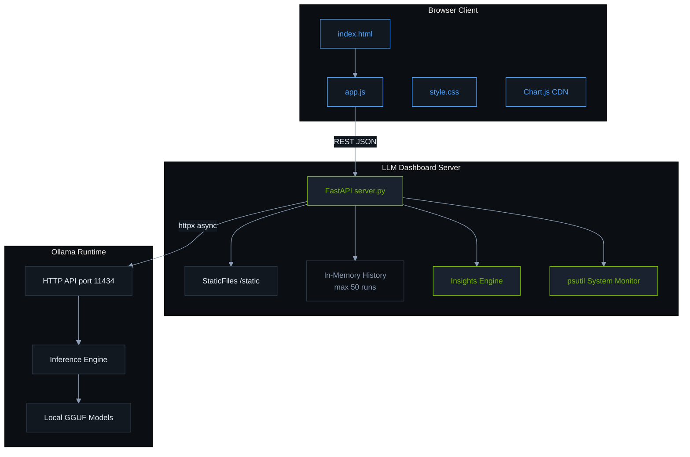

### Technology Stack

| Layer | Technology | Version / Notes |
|-------|------------|-----------------|
| Backend | Python 3, FastAPI | Async HTTP via `httpx` |
| ASGI Server | Uvicorn | Default host `0.0.0.0`, port `8765` |
| System metrics | psutil | CPU, RAM, swap snapshots |
| Frontend | Vanilla JavaScript | No build step required |
| Charts | Chart.js 4.4.7 | Loaded from jsDelivr CDN |
| LLM runtime | Ollama | Must be running separately |

### Component Responsibilities

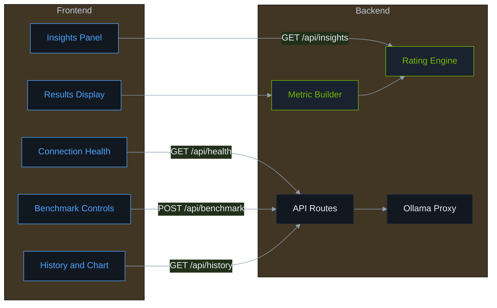

---

## 3. System Requirements

### Software

| Requirement | Minimum |
|-------------|---------|
| Python | 3.10+ (uses `list[dict]` type hints) |
| Ollama | Installed and running with at least one model pulled |
| OS | Linux, macOS, or Windows (tested on Linux) |
| Browser | Modern browser with ES6+ support |

### Hardware Considerations

Performance numbers are **hardware-dependent**. Meaningful benchmarks require:

- Sufficient RAM for the model (check Ollama model size vs. available memory)
- GPU acceleration if configured in Ollama (dashboard reports throughput regardless of CPU/GPU backend)
- Minimal competing load during benchmarks for consistent results

---

## 4. Installation & Setup

### Quick Start

```bash
# 1. Ensure Ollama is running
ollama serve          # if not already running as a service
ollama pull llama3.2  # example: pull a model

# 2. Start the dashboard
cd LLM-Dashboard
./start.sh
```

The dashboard will be available at **http://localhost:8765** (default).

### What `start.sh` Does

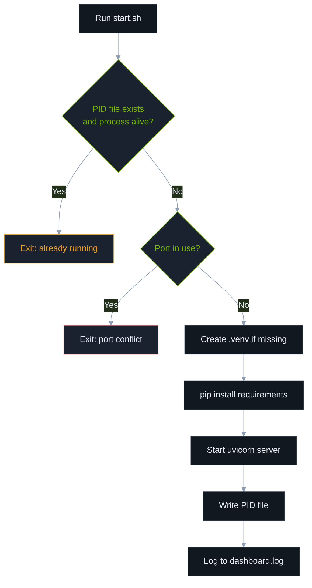

### Manual Start (Alternative)

```bash
python3 -m venv .venv
source .venv/bin/activate
pip install -r requirements.txt
export OLLAMA_BASE_URL=http://127.0.0.1:11434  # optional
uvicorn server:app --host 0.0.0.0 --port 8765 --reload
```

### Python Dependencies

| Package | Purpose |
|---------|---------|
| `fastapi` | Web framework and request validation |
| `uvicorn[standard]` | ASGI server |
| `httpx` | Async HTTP client for Ollama API |
| `psutil` | Host system metrics |

---

## 5. Configuration

### Environment Variables

| Variable | Default | Description |
|----------|---------|-------------|
| `OLLAMA_BASE_URL` | `http://127.0.0.1:11434` | Base URL for Ollama HTTP API |
| `PORT` | `8765` | Dashboard listen port (via `start.sh` only) |

### Server Constants (in `server.py`)

| Constant | Value | Description |
|----------|-------|-------------|
| `HISTORY_LIMIT` | `50` | Maximum benchmark runs stored in memory |
| Benchmark timeout | `600s` | Max wait for main generation request |
| Warmup timeout | `300s` | Max wait for warmup generation |
| Health/models timeout | `30s` | Timeout for lightweight Ollama GET requests |

---

## 6. Project Structure

```
LLM-Dashboard/
├── server.py           # FastAPI backend: API routes, metrics, insights
├── start.sh            # Production-style launcher script
├── requirements.txt    # Python dependencies
├── DOCUMENTATION.md    # This file
├── dashboard.log       # Server stdout/stderr (created at runtime)
├── .dashboard.pid      # Process ID file (created at runtime)
├── .venv/              # Python virtual environment (created by start.sh)
└── static/
    ├── index.html      # Dashboard UI layout
    ├── app.js          # Frontend logic, API calls, chart rendering
    └── style.css       # Dark-theme styling
```

---

## 7. Benchmark Workflow

### End-to-End Flow

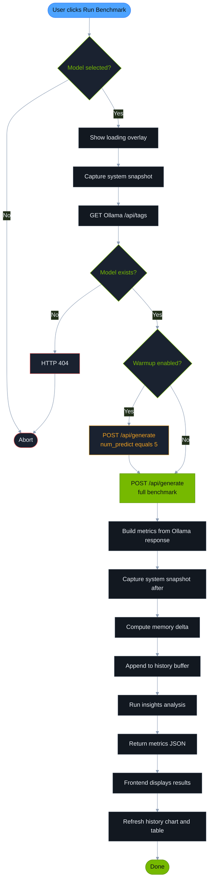

### Benchmark Sequence Diagram

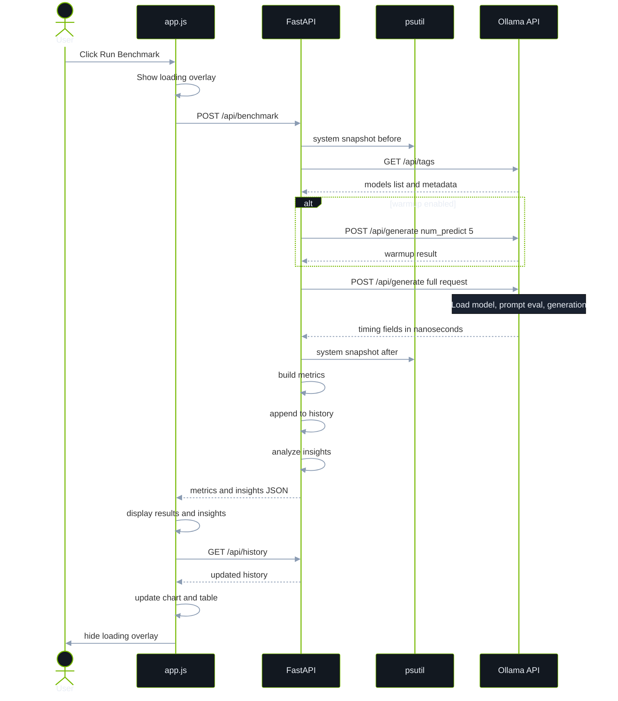

### Page Load Sequence

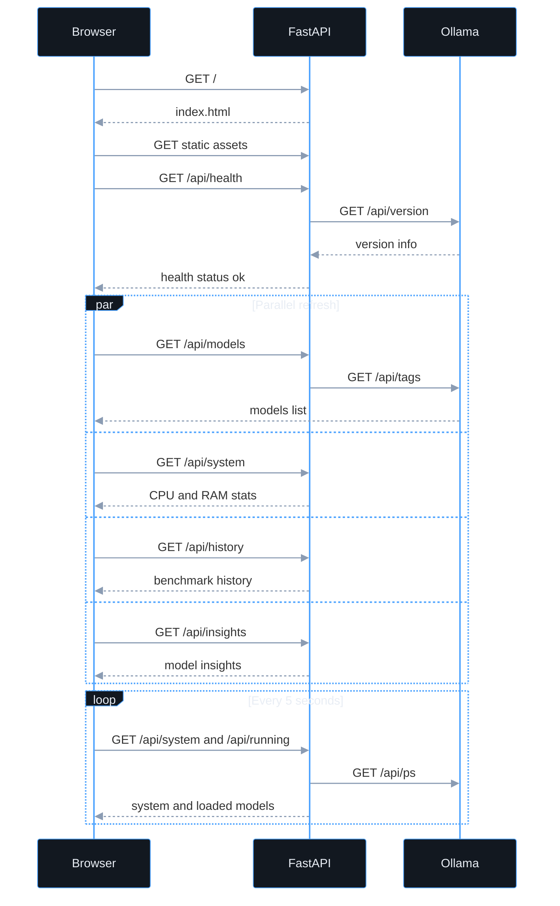

---

## 8. LLM Performance Evaluation

This dashboard evaluates **inference performance** (speed, latency, resource usage), not **output quality**. Understanding this distinction is essential for interpreting results.

### Evaluation Dimensions

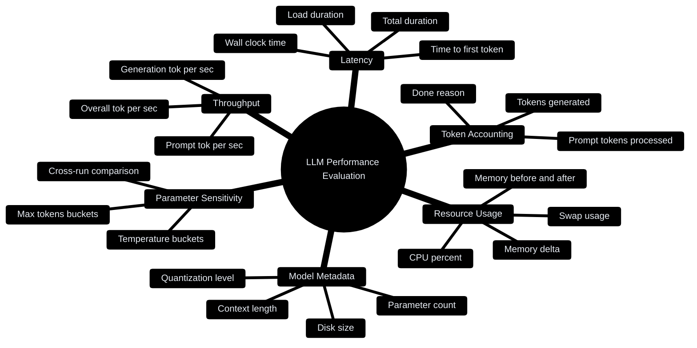

### Evaluation Methodology

#### 1. Controlled Generation Benchmark

Each run sends a **single non-streaming** `POST /api/generate` request to Ollama with:

- A user-defined or preset prompt (controls prompt token count and task type)
- Fixed `num_predict` (maximum tokens to generate)
- Fixed `temperature` (sampling randomness)

Ollama returns nanosecond-precision timing fields that the dashboard converts to seconds and derives throughput from.

#### 2. Warmup Protocol (Recommended)

When **warm-up** is enabled (default):

1. A short generation runs first with `num_predict = 5` to load the model into memory.
2. The main benchmark run follows immediately.

**Purpose:** The first request to a cold model includes **model load time** (`load_duration`). Warmup separates cold-start loading from the measured benchmark, giving more consistent throughput readings for the primary run.

**Trade-off:** Total wall-clock time increases; load time on the main run may still be non-zero if Ollama unloads the model between requests.

#### 3. Relative Rating (Not Absolute)

The dashboard does **not** define fixed thresholds like "50 tok/s = good." Instead, it uses **percentile ranking within your own benchmark history** for a given model:

- Compare each metric against all prior runs for that model
- Classify as **Best**, **Expected**, or **Poor**

This makes the tool useful for **A/B testing parameters** on your hardware, not for publishing absolute leaderboard scores.

#### 4. Prompt Diversity (Qualitative Stress Testing)

Four built-in presets exercise different workload shapes:

| Preset | Workload Type | What It Stresses |
|--------|---------------|------------------|
| **Short** | Simple completion | Baseline generation speed, minimal prompt |
| **Essay** | Long-form prose | Sustained generation, larger output |
| **Code** | Structured syntax | Token patterns unlike natural language |
| **Reasoning** | Chain-of-thought | Longer prompt, logical structure |

Use consistent prompts when comparing parameters; change prompts when exploring task-specific performance.

#### 5. What Quality Evaluation Would Require (Out of Scope)

To evaluate **model quality**, you would need additional tooling:

| Approach | Examples |
|----------|----------|
| Reference-based scoring | BLEU, ROUGE, exact match on benchmarks |
| LLM-as-judge | GPT-4 grading responses against rubrics |
| Human evaluation | Side-by-side preference ranking |
| Standard benchmarks | MMLU, HumanEval, GSM8K via dedicated harnesses |

This dashboard provides the **performance layer** that complements quality benchmarks — e.g., "Model A scores 5% higher on MMLU but runs 3× slower."

---

## 9. Parameters & Inference Options

### User-Configurable Parameters

| Parameter | UI Control | API Field | Default | Range | Effect |
|-----------|------------|-----------|---------|-------|--------|
| **Model** | Dropdown | `model` | (first available) | Installed Ollama models | Determines architecture, size, quantization |
| **Prompt** | Textarea | `prompt` | See `index.html` | Free text | Affects prompt token count and generation behavior |
| **Max Tokens** | Number input | `num_predict` | `128` | `1` – `4096` | Upper bound on generated tokens; actual count may be lower if model stops early |
| **Temperature** | Slider (0.0–2.0) | `temperature` | `0.7` | `0.0` – `2.0` | Controls randomness; **should not affect throughput significantly** on most backends, but is tracked for experiment reproducibility |
| **Warm-up** | Checkbox | `warmup` | `true` | boolean | Pre-loads model with a 5-token generation |

### Ollama Options Payload

The backend sends this structure to Ollama:

```json
{
  "model": "llama3.2:latest",
  "prompt": "Your benchmark prompt here",
  "stream": false,
  "options": {
    "num_predict": 128,
    "temperature": 0.7
  }
}
```

### Parameters Not Exposed (Future Extensions)

Ollama supports additional options not currently in the UI:

| Ollama Option | Description |
|---------------|-------------|
| `top_p` | Nucleus sampling |
| `top_k` | Top-k sampling |
| `repeat_penalty` | Repetition suppression |
| `num_ctx` | Context window size |
| `num_gpu` | GPU layer offloading |
| `seed` | Deterministic sampling |

---

## 10. Metrics Reference

### Timing Metrics

All Ollama durations are reported in **nanoseconds** internally and converted to **seconds** (4 decimal places) by the dashboard.

| Metric | Ollama Source Field | Formula / Notes |
|--------|---------------------|-----------------|
| **Load duration** | `load_duration` | Time to load model weights into memory |
| **Prompt eval duration** | `prompt_eval_duration` | Time to process (embed + forward) the input prompt |
| **Generation duration** | `eval_duration` | Time spent generating output tokens |
| **Total duration** | `total_duration` | End-to-end Ollama-reported time for the request |
| **Time to first token (TTFT)** | Derived | `load_duration_s + prompt_eval_duration_s` |
| **Wall clock** | Derived | Python `time.perf_counter()` around the main HTTP call |

```mermaid
%%{init: {"theme": "base", "themeVariables": {"sectionBkgColor": "#121820", "altSectionBkgColor": "#1a2230", "sectionBkgColor2": "#0b0f14", "taskBkgColor": "#76b900", "taskTextColor": "#0b0f14", "activeTaskBkgColor": "#4da3ff", "gridColor": "#2a3544", "todayLineColor": "#e05252"}}}%%
gantt
    title Typical Request Timeline
    dateFormat X
    axisFormat %s

    section Load
    Load model           :done, load, 0, 2

    section Prompt
    Prompt evaluation    :active, prompt, 2, 3

    section Generate
    Token generation     :gen, 3, 8
```

### Throughput Metrics

| Metric | Formula | Unit |
|--------|---------|------|
| **Prompt tokens/sec** | `prompt_eval_count / prompt_eval_duration` | tok/s |
| **Generation tokens/sec** | `eval_count / eval_duration` | tok/s |
| **Overall tokens/sec** | `(prompt_eval_count + eval_count) / total_duration` | tok/s |

> **Primary KPI:** `eval_tokens_per_sec` (generation speed) is the headline metric used for insights, charting, and best-run selection.

### Token Metrics

| Metric | Source | Description |
|--------|--------|-------------|
| `prompt_eval_count` | Ollama | Tokens in the prompt |
| `eval_count` | Ollama | Tokens actually generated |
| `total_tokens` | Derived | Sum of prompt + generated |
| `done_reason` | Ollama | Why generation stopped (`stop`, `length`, etc.) |

### System Metrics

Captured via `psutil` before and after each benchmark:

| Field | Description |
|-------|-------------|
| `memory_total_gb` | Total system RAM |
| `memory_used_gb` | Used RAM at snapshot time |
| `memory_available_gb` | Available RAM |
| `memory_percent` | RAM utilization % |
| `swap_used_gb` | Swap space in use |
| `cpu_percent` | CPU utilization (0.1s sample interval) |
| `cpu_count` | Logical CPU cores |
| `memory_delta_gb` | `memory_used_after - memory_used_before` |

### Model Metadata

Pulled from Ollama `/api/tags` for the selected model:

| Field | Description |
|-------|-------------|
| `parameter_size` | e.g., `7B`, `13B` |
| `quantization_level` | e.g., `Q4_K_M`, `Q8_0` |
| `family` | Model family (llama, gemma, etc.) |
| `format` | File format (usually `gguf`) |
| `context_length` | Maximum context window |
| `embedding_length` | Embedding dimension |
| `size_bytes` / `size_human` | On-disk model size |
| `digest` | Model content hash |

---

## 11. Evaluation Criteria & Ratings

### Rating Categories

The dashboard assigns one of three ratings by comparing a value against **all benchmark runs for the same model**:

| Rating | Color (UI) | Meaning |
|--------|------------|---------|
| **Best** | Green accent | Top quartile (≤25th percentile rank from best) or tied for best value |
| **Expected** | Default | Middle performance band |
| **Poor** | Red/warn | Bottom quartile (≥75th percentile rank from best) or tied for worst |

### Metrics Rated

| Metric Key | Label | Higher is Better? |
|------------|-------|-------------------|
| `eval_tokens_per_sec` | Generation speed | Yes |
| `prompt_tokens_per_sec` | Prompt speed | Yes |
| `time_to_first_token_s` | Time to first token | **No** (lower is better) |
| `load_duration_s` | Load time | **No** (lower is better) |

### Percentile Algorithm

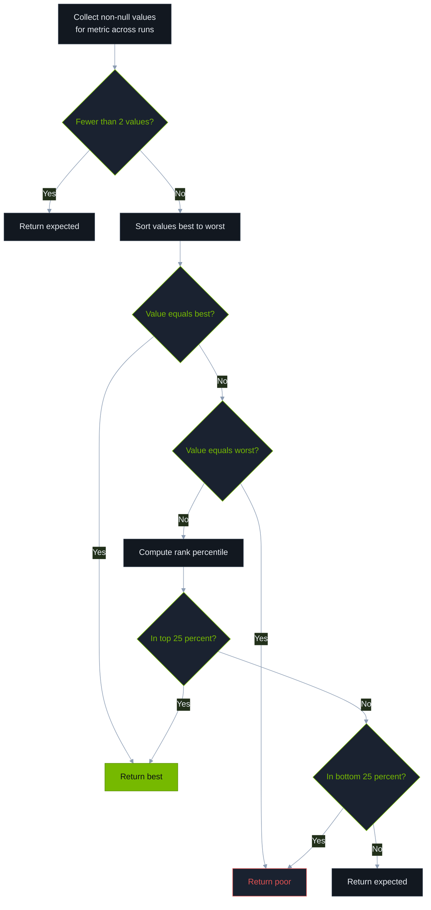

### Parameter Rating

For `temperature` and `num_predict`, the engine:

1. Groups runs by parameter value
2. Computes average `eval_tokens_per_sec` per bucket
3. Rates each bucket relative to other buckets for that parameter

**Example:** If temperature `0.7` averages 45 tok/s and `1.2` averages 38 tok/s across your runs, `0.7` may be rated "Best" for throughput.

> Temperature theoretically affects sampling, not compute speed; observed differences usually reflect variance, prompt length changes, or thermal throttling — not causation. Use ratings as hints, not ground truth.

### Best Run Selection

The **best run** is the historical entry with the highest `eval_tokens_per_sec` for the model, regardless of temperature or max tokens. Displayed only when **more than one run** exists.

---

## 12. Insights Engine

The `_analyze_model_insights()` function in `server.py` aggregates per-model history into actionable summaries.

### Data Flow

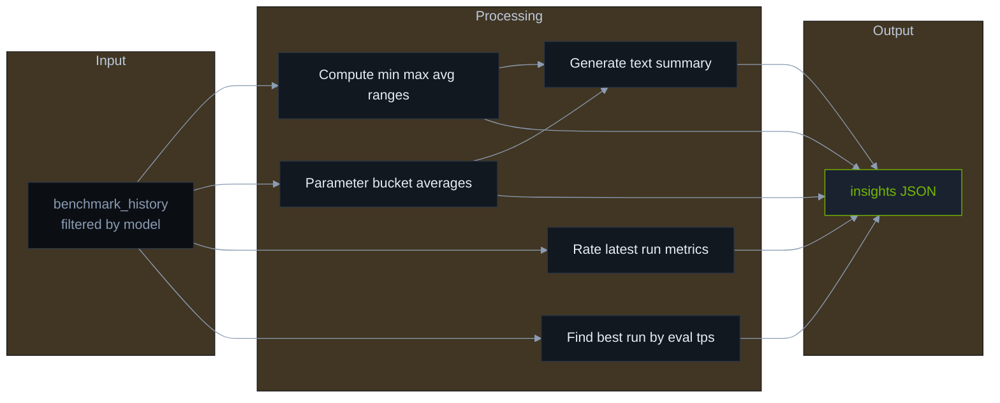

### Insights Response Structure

```json
{
  "runs": 5,
  "ranges": {
    "generation_tok_per_sec": { "min": 32.1, "max": 48.7, "avg": 41.2 },
    "time_to_first_token_s": { "min": 0.8, "max": 2.1, "avg": 1.3 }
  },
  "parameters": [
    {
      "parameter": "temperature",
      "label": "Temperature",
      "value": 0.7,
      "avg_eval_tps": 45.2,
      "runs": 3,
      "rating": "best"
    }
  ],
  "metrics": [
    {
      "key": "eval_tokens_per_sec",
      "label": "Generation speed",
      "value": 44.1,
      "rating": "expected"
    }
  ],
  "best_run": {
    "eval_tokens_per_sec": 48.7,
    "temperature": 0.7,
    "num_predict": 128,
    "eval_count": 120,
    "benchmark_at": "2026-06-25T12:00:00+00:00"
  },
  "summary": "Best throughput settings: Temperature 0.7. Generation speed observed 32.1–48.7 tok/s (avg 41.2)."
}
```

### Observed Range Keys

| Key | Tracks |
|-----|--------|
| `tokens_generated` | Actual `eval_count` per run |
| `max_tokens_requested` | `num_predict` setting |
| `temperature` | Temperature setting |
| `generation_tok_per_sec` | Generation throughput |
| `prompt_tok_per_sec` | Prompt throughput |
| `time_to_first_token_s` | TTFT |
| `load_duration_s` | Model load time |

---

## 13. REST API Reference

### `GET /`

Serves the dashboard HTML.

### `GET /api/health`

Checks Ollama connectivity.

**Response (200):**
```json
{
  "status": "ok",
  "ollama": { "version": "0.5.4" },
  "ollama_url": "http://127.0.0.1:11434"
}
```

**Response (503):** Ollama unreachable.

---

### `GET /api/models`

Lists installed Ollama models (sorted by name).

**Response:**
```json
{
  "models": [
    {
      "name": "llama3.2:latest",
      "size": 2019393189,
      "digest": "sha256:...",
      "details": {
        "parameter_size": "3.2B",
        "quantization_level": "Q4_K_M",
        "family": "llama"
      }
    }
  ]
}
```

---

### `GET /api/running`

Proxies Ollama `GET /api/ps` — models currently loaded in memory.

---

### `GET /api/system`

Host system stats plus Ollama version.

**Response:**
```json
{
  "memory_total_gb": 64.0,
  "memory_used_gb": 28.4,
  "memory_available_gb": 35.6,
  "memory_percent": 44.4,
  "swap_used_gb": 0.0,
  "cpu_percent": 12.5,
  "cpu_count": 16,
  "ollama_version": "0.5.4"
}
```

---

### `POST /api/benchmark`

Runs a benchmark. **Request body:**

```json
{
  "model": "llama3.2:latest",
  "prompt": "Write a short paragraph about local LLM inference.",
  "num_predict": 128,
  "temperature": 0.7,
  "warmup": true
}
```

| Field | Type | Required | Constraints |
|-------|------|----------|-------------|
| `model` | string | Yes | Must exist in Ollama |
| `prompt` | string | No | Default provided |
| `num_predict` | int | No | 1–4096 |
| `temperature` | float | No | 0.0–2.0 |
| `warmup` | bool | No | Default `true` |

**Response:** Full metrics object (see [Metrics Reference](#10-metrics-reference)) including `insights` for the model.

**Errors:**
- `404` — Model not found
- `502` — Ollama request failed

---

### `GET /api/history`

Returns up to 50 most recent runs (newest first).

```json
{ "history": [ /* array of metric objects */ ] }
```

---

### `DELETE /api/history`

Clears all stored benchmark history.

```json
{ "cleared": true }
```

---

### `GET /api/insights`

**Query params:**
- `model` (optional) — Filter insights to one model

**Without `model`:** Returns insights for all models keyed by name.

**With `model`:** Returns single-model insights object.

---

## 14. Frontend UI Guide

### Layout

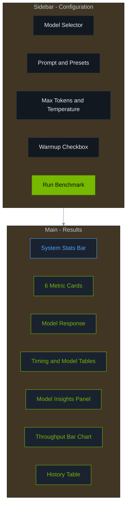

### UI Sections

| Section | Updates When |
|---------|--------------|
| **System bar** | Every 5 seconds + after benchmark |
| **Metric cards** | After each benchmark (with color ratings) |
| **Model response** | After each benchmark |
| **Insights panel** | On model change + after benchmark |
| **Chart** | On history load/clear |
| **History table** | On history load/clear; color-codes generation tok/s |

### Connection States

| State | Indicator |
|-------|-----------|
| Connected | Green dot, "Ollama connected", Run button enabled |
| Disconnected | Red dot, "Ollama offline", Run button disabled |

---

## 15. Prompt Presets

Defined in `static/app.js`:

| Key | Prompt Purpose |
|-----|----------------|
| `short` | `"Count from 1 to 20, one number per line."` |
| `essay` | 200-word essay on local vs. cloud LLMs |
| `code` | Python binary search with docstring |
| `reason` | Classic reasoning puzzle with step-by-step explanation |

### Benchmarking Recommendations

1. **Baseline run** — Use the default prompt with warmup enabled; note generation tok/s.
2. **Parameter sweep** — Fix the prompt; vary `num_predict` (64, 128, 256, 512) and temperature (0.0, 0.7, 1.0).
3. **Workload comparison** — Fix parameters; run all four presets to see task-shaped variance.
4. **Cold vs. warm** — Disable warmup once to measure true cold-start load time.
5. **Repeat runs** — Run 3–5 times per setting; ratings become meaningful after 2+ runs.

---

## 16. Limitations & Best Practices

### Limitations

| Limitation | Impact |
|------------|--------|
| In-memory history | Lost on server restart |
| No authentication | Do not expose to untrusted networks without a reverse proxy |
| Single concurrent benchmark | Parallel clicks queue on the client (button disabled during run) |
| Ollama timing accuracy | Depends on Ollama version and backend (CPU/GPU) |
| No streaming | TTFT is estimated from load + prompt eval, not first streamed chunk |
| Relative ratings only | Cannot judge if 20 tok/s is "good" without external context |

### Best Practices for Reliable Benchmarks

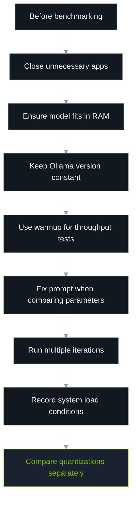

1. **Isolate variables** — Change one parameter at a time.
2. **Control prompt length** — Longer prompts increase `prompt_eval_duration` and affect overall tok/s.
3. **Watch `done_reason`** — `length` means you hit `num_predict`; `stop` means natural completion.
4. **Monitor memory delta** — Large positive deltas may indicate model loading; swap usage degrades speed.
5. **Document hardware** — Record GPU model, driver, and Ollama `num_gpu` settings externally.

---

## 17. Troubleshooting

| Symptom | Likely Cause | Solution |
|---------|--------------|----------|
| "Ollama offline" | Ollama not running | Run `ollama serve` or start Ollama service |
| "Model not found" | Model not pulled | `ollama pull <model>` |
| Benchmark timeout | Slow hardware or huge `num_predict` | Reduce max tokens; check GPU offload |
| Port already in use | Another process on 8765 | `PORT=9000 ./start.sh` |
| All ratings "expected" | Only one run recorded | Run more benchmarks |
| Wildly varying tok/s | Thermal throttling, background load | Cool down GPU; reduce system load |
| Empty response | Model error or context issue | Check `dashboard.log` and Ollama logs |

### Log Locations

| File | Contents |
|------|----------|
| `dashboard.log` | Uvicorn server output |
| Ollama logs | Platform-specific (journalctl, Console.app, etc.) |

### Verify Ollama Manually

```bash
curl http://127.0.0.1:11434/api/version
curl http://127.0.0.1:11434/api/tags
curl http://127.0.0.1:11434/api/generate -d '{
  "model": "llama3.2",
  "prompt": "Hello",
  "stream": false
}'
```

---

## 18. Extending the Dashboard

### Common Extension Points

| Goal | Where to Change |
|------|-----------------|
| Add inference parameters | `BenchmarkRequest` in `server.py` + UI controls in `index.html` / `app.js` |
| Persist history | Replace `benchmark_history` list with SQLite/JSON file |
| Add GPU metrics | Integrate `pynvml` in `_system_snapshot()` |
| Streaming TTFT | Switch to `stream: true` and measure first chunk arrival |
| Quality scoring | Add post-generation evaluation endpoint |
| Multi-model batch | Queue system running sequential `/api/benchmark` calls |
| Export results | `GET /api/history` → CSV download endpoint |

### Adding a New API Route (Example Pattern)

```python
@app.get("/api/example")
async def example():
    return {"data": "value"}
```

### Adding a New Metric to Insights

1. Extract values in `_analyze_model_insights()` from `entries`
2. Add to `ranges` dict with `_range_stats()`
3. Optionally add to `metric_defs` for latest-run rating
4. Update `RANGE_LABELS` in `app.js` for UI display

---

## Quick Reference Card

```
┌─────────────────────────────────────────────────────────────┐
│  LLM Benchmark Dashboard — Quick Reference                  │
├─────────────────────────────────────────────────────────────┤
│  Start:     ./start.sh                                      │
│  URL:       http://localhost:8765                           │
│  Ollama:    http://127.0.0.1:11434 (OLLAMA_BASE_URL)        │
│  Primary KPI: eval_tokens_per_sec (generation throughput)   │
│  Key latency: time_to_first_token_s (load + prompt eval)    │
│  History:   50 runs in memory (cleared on restart)          │
│  Ratings:   Best / Expected / Poor (relative to your runs)  │
└─────────────────────────────────────────────────────────────┘
```

---

*Documentation generated for LLM Benchmark Dashboard v1.0.0*
