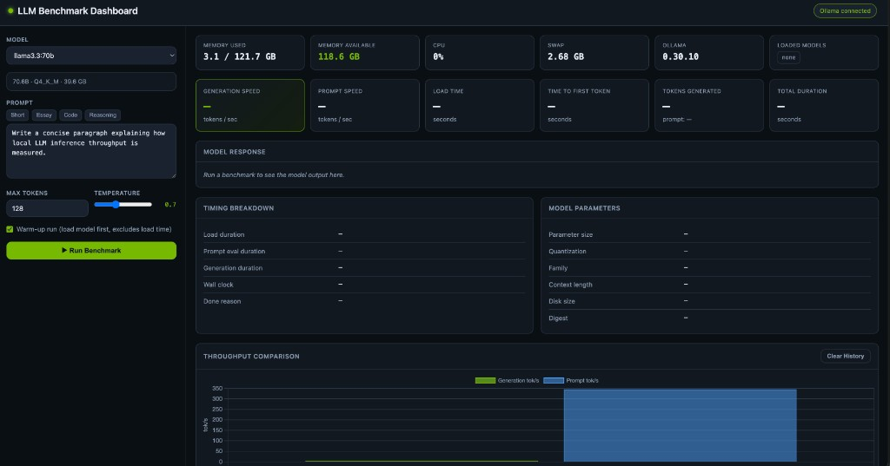
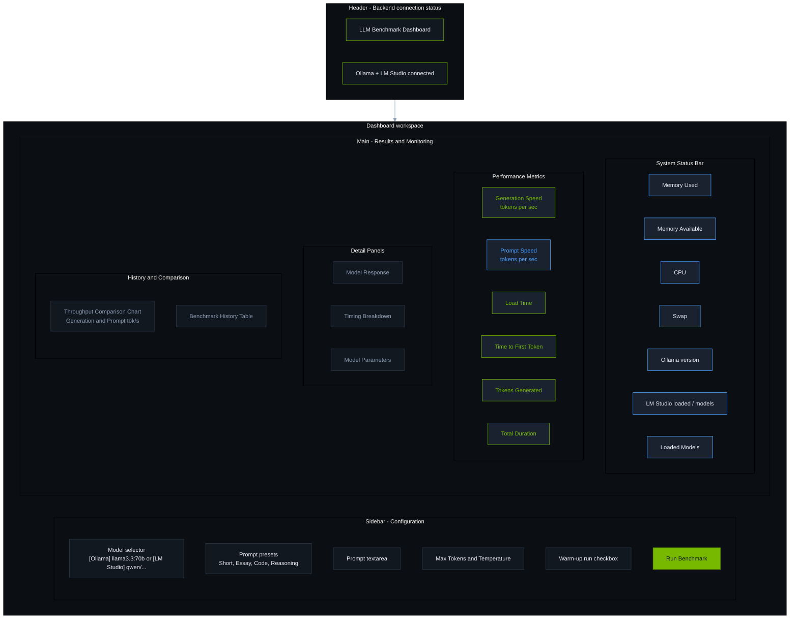
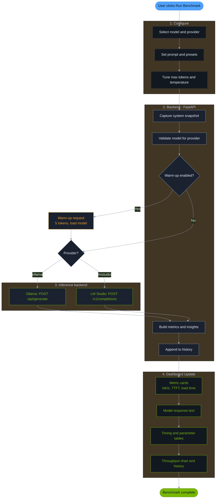
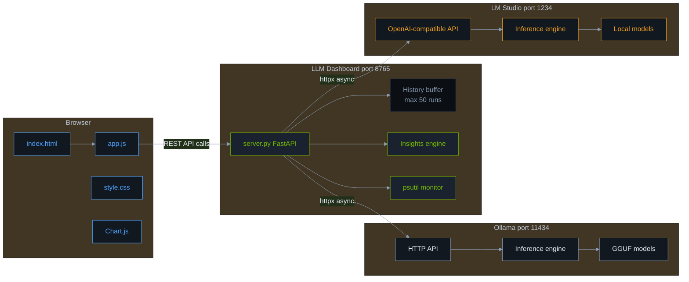

# LLM Benchmark Dashboard

A web dashboard for benchmarking **local LLM inference performance** via [Ollama](https://ollama.com) and [LM Studio](https://lmstudio.ai). Measure throughput, latency, time-to-first-token, and compare parameter settings across benchmark runs — from either backend in one UI.



## Quick Start

```bash
# Prerequisites: at least one inference backend running with a model available

# Option A — Ollama
ollama serve
ollama pull llama3.2

# Option B — LM Studio
# Install LM Studio, start the local server (default port 1234), and load a model

# Start the dashboard (works with either or both backends)
./start.sh
# Open http://localhost:8765
```

Select a model from the dropdown — entries are labeled `[Ollama]` or `[LM Studio]`. The dashboard connects to whichever backends are online.

## Dashboard Layout

The UI is organized into a **configuration sidebar** (left) and a **results workspace** (right). Colors follow the dark theme: green for generation metrics, blue for prompt metrics.



## Benchmark Flow

From user click to displayed results — green steps are generation-focused, blue steps are prompt/system, gray steps are orchestration. The backend routes to Ollama or LM Studio based on the selected model's provider.



## Architecture



### Color Legend

Diagrams use the same palette as `static/style.css`. See [DOCUMENTATION.md](./DOCUMENTATION.md#diagram-color-theme) for the full style reference.

| Color | Hex | Used For |
|-------|-----|----------|
| Green | `#76b900` | Generation speed, primary actions, success |
| Blue | `#4da3ff` | Prompt speed, system bar, user interaction |
| Amber | `#f0a020` | Warm-up phase, LM Studio nodes |
| Red | `#e05252` | Model load step, errors |
| Dark surface | `#121820` / `#1a2230` | Panels and cards |
| Muted text | `#8b9cb3` | Labels and secondary info |

## Features

- Benchmark models from **Ollama** or **LM Studio** in a single dashboard
- Run controlled generation benchmarks with configurable prompts and parameters
- View generation speed, prompt speed, load time, and time-to-first-token
- Monitor host CPU, memory, and loaded models from both backends
- Track benchmark history with charts and comparative insights (scoped per provider + model)
- Rate performance relative to your own runs (Best / Expected / Poor)

## Documentation

**[Full Technical Documentation → DOCUMENTATION.md](./DOCUMENTATION.md)**

The comprehensive guide covers:

- Architecture and Mermaid diagrams (flow, sequence, component)
- Ollama and LM Studio benchmark paths and metric derivation
- LLM performance evaluation methodology
- All metrics, parameters, and evaluation criteria
- REST API reference
- UI guide, troubleshooting, and extension points

## Configuration

| Variable | Default | Description |
|----------|---------|-------------|
| `OLLAMA_BASE_URL` | `http://127.0.0.1:11434` | Ollama API URL |
| `LMSTUDIO_BASE_URL` | `http://127.0.0.1:1234` | LM Studio local server URL |
| `PORT` | `8765` | Dashboard port (`start.sh`) |

At least one backend must be reachable. Both can run simultaneously — the model dropdown merges LLM models from each provider.

## Stack

Python · FastAPI · Uvicorn · httpx · psutil · Vanilla JS · Chart.js · Ollama · LM Studio

## License

See repository for license details.
