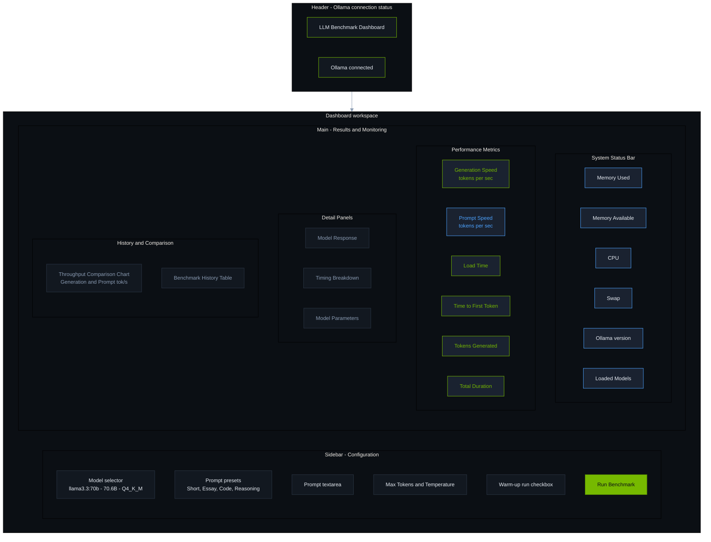
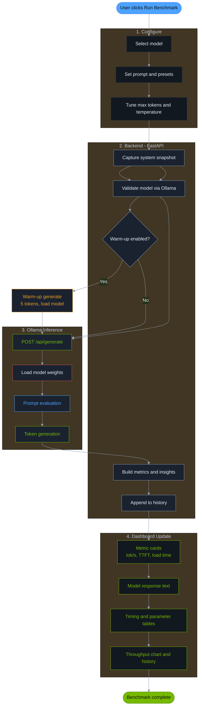
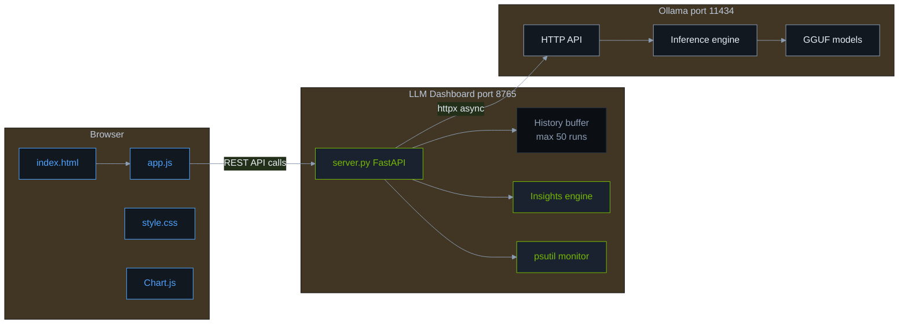

# LLM Benchmark Dashboard

A web dashboard for benchmarking **local LLM inference performance** via [Ollama](https://ollama.com). Measure throughput, latency, time-to-first-token, and compare parameter settings across benchmark runs.


## Quick Start

```bash
# Prerequisites: Ollama running with at least one model
ollama serve
ollama pull llama3.2

# Start the dashboard
./start.sh
# Open http://localhost:8765
```

## Dashboard Layout

The UI is organized into a **configuration sidebar** (left) and a **results workspace** (right). Colors follow the dark theme: green for generation metrics, blue for prompt metrics.



## Benchmark Flow

From user click to displayed results — green steps are generation-focused, blue steps are prompt/system, gray steps are orchestration.



## Architecture



### Color Legend

Diagrams use the same palette as `static/style.css`. See [DOCUMENTATION.md](./DOCUMENTATION.md#diagram-color-theme) for the full style reference.

| Color | Hex | Used For |
|-------|-----|----------|
| Green | `#76b900` | Generation speed, primary actions, success |
| Blue | `#4da3ff` | Prompt speed, system bar, user interaction |
| Amber | `#f0a020` | Warm-up phase |
| Red | `#e05252` | Model load step, errors |
| Dark surface | `#121820` / `#1a2230` | Panels and cards |
| Muted text | `#8b9cb3` | Labels and secondary info |

## Features

- Run controlled generation benchmarks with configurable prompts and parameters
- View generation speed, prompt speed, load time, and time-to-first-token
- Monitor host CPU, memory, and loaded Ollama models
- Track benchmark history with charts and comparative insights
- Rate performance relative to your own runs (Best / Expected / Poor)

## Documentation

**[Full Technical Documentation → DOCUMENTATION.md](./DOCUMENTATION.md)**

The comprehensive guide covers:

- Architecture and Mermaid diagrams (flow, sequence, component)
- LLM performance evaluation methodology
- All metrics, parameters, and evaluation criteria
- REST API reference
- UI guide, troubleshooting, and extension points

## Configuration

| Variable | Default | Description |
|----------|---------|-------------|
| `OLLAMA_BASE_URL` | `http://127.0.0.1:11434` | Ollama API URL |
| `PORT` | `8765` | Dashboard port (`start.sh`) |

## Stack

Python · FastAPI · Uvicorn · httpx · psutil · Vanilla JS · Chart.js · Ollama

## License

See repository for license details.
